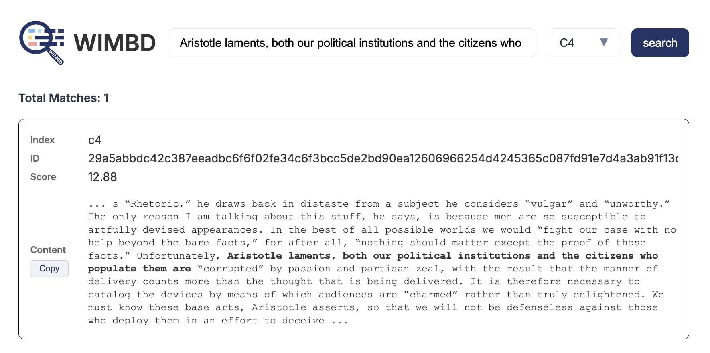
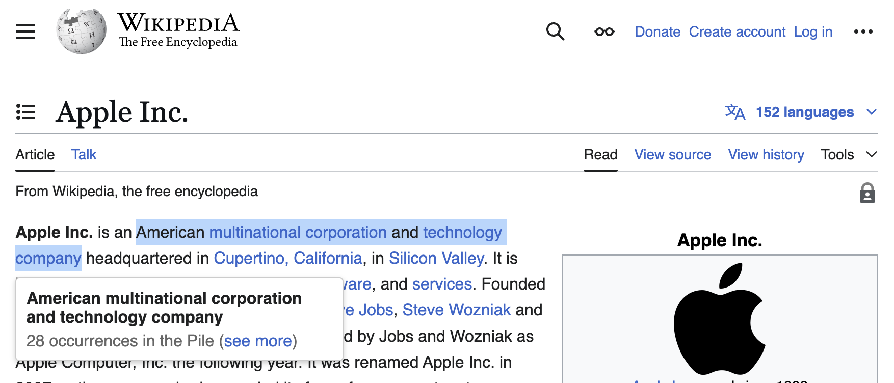

A chrome extension and search page for [WIMBD](https://wimbd.apps.allenai.org/).

**This is not hosted publicly, you will need to [request an API key](https://github.com/allenai/wimbd/tree/main?tab=readme-ov-file#search) to use.**

### Examples

Here the WIMBD search engine:

<div align="center">

</div>
<br />

The chrome extension allows highlighting text on a page and searching occurances:

<div align="center">

</div>


### Setup
```sh
# 1) Install chrome extension at: chrome://extensions/
#    (click "load unpacked" and point to /extension)

# 2) Install and run server for ElasticSearch
cd server
npm install
npm start

# Navigate to https://localhost:3000
```

```sh
# To have it run continuously on a Mac (even after restarts)
pm2 start ecosystem.config.js
pm2 logs wimbd --lines 10

pm2 startup
pm2 save

# To shut down the server + flush logs
pm2 stop wimbd && pm2 flush wimbd
```